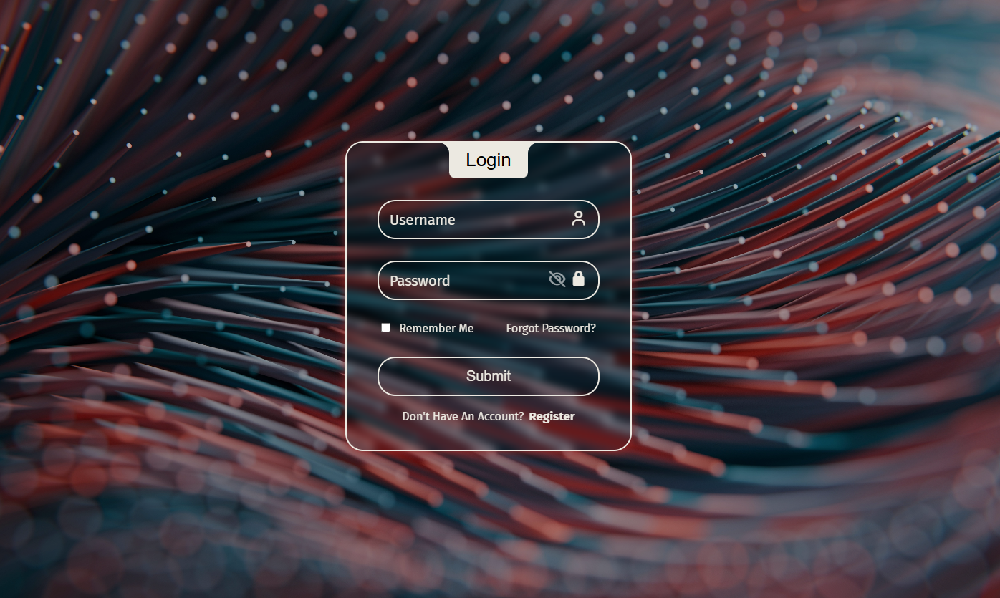

🚀 Login-Form-Html-Css
---

---

💻 پروژه فرم لاگین شیک و حرفه‌ای با HTML & CSS

🔹 فارسی

✨ توضیحات:
این پروژه یک فرم لاگین فوق‌العاده شیک است که با HTML و CSS طراحی شده و تمرکز آن بر روی:

🖌️ طراحی مینیمال و مدرن

🎨 انیمیشن‌های جذاب و روان

✨ افکت‌های هاور خلاقانه

🧹 کدنویسی تمیز، اصولی و حرفه‌ای

🎯 هدف پروژه:

نمونه کار حرفه‌ای برای نمایش توانایی‌ها

جذب پروژه‌ها و فرصت‌های شغلی

🖼️ پیش‌نمایش:

⚡ نحوه استفاده:

پروژه را دانلود یا کلون کنید

فایل index.html را در مرورگر باز کنید

مشاهده زنده پروژه:

🔹 English

✨ Description:
This is a sleek and professional login form designed with HTML & CSS, focusing on:

🖌️ Minimal & modern design

🎨 Smooth and attractive animations

✨ Creative hover effects

🧹 Clean, semantic, and professional code

🎯 Project Goal:

Showcase skills as a professional portfolio piece

Attract projects and job opportunities

🖼️ Live Demo:

⚡ How to use:

Download or clone the project

Open index.html in your browser
